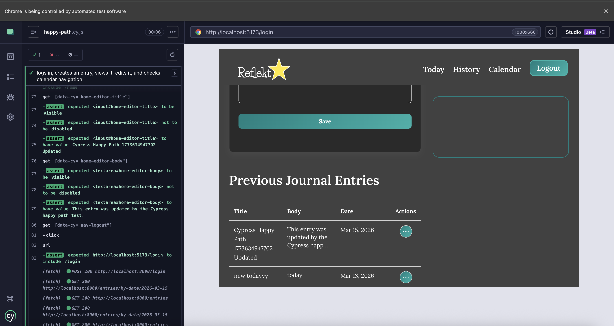

This repository will have the frontend and backend code for my
app for CSC 307.

# Project Blurb

Reflekt is a web-based journaling application designed to help
users capture and reflect on their daily experiences in a simple
and organized way. The app allows users to create, edit, and
manage personal journal entries while tracking moods and
attaching daily photos to better document their reflections.
Reflekt provides an intuitive interface for browsing entries
through both table and calendar views, making it easy for users
to revisit past thoughts and experiences. The application is
built using a React frontend, an Express/Node.js backend, and
MongoDB for data storage, following a RESTful API architecture
and modular code structure.

Link to app https://witty-desert-068c7511e.6.azurestaticapps.net/

demo video https://drive.google.com/file/d/1QPLdtCu0qw3J8hW20EYXweIVGR_uocKd/view?usp=sharing

UI Prototype https://www.figma.com/board/KnbPbkewg3EMxg9EJwa31j/UML-diagram--Copy-?node-id=0-1&t=xSpA1cFNtlIosgA5-1

<video src="CSC-307-TEAM-PIXELS/mid-fi_Prototype.mov" width="320" height="240" controls></video>

# Development Environment Setup

The following instructions describe how to set up the Reflekt
development environment locally.

## Prerequisites

Before starting, make sure the following software is installed:

Node.js (v18 or newer) https://nodejs.org

npm (comes with Node.js)

Git https://git-scm.com

MongoDB Atlas account (or local MongoDB instance)
https://www.mongodb.com

VS Code (recommended editor) https://code.visualstudio.com

## 1. Clone the Repository

## 2. Install Dependencies

Install backend dependencies:

cd backend npm install

Install frontend dependencies:

cd ../frontend npm install

## 3. Configure Environment Variables

Create a .env file inside the backend directory.

Example .env file:

MONGO_CONNECTION_STRING=your_mongodb_connection_string
TOKEN_SECRET=your_secret_key

These variables configure the backend server and database
connection.

## 4. Start the Backend Server

From the backend directory:

npm start

The backend API should start on:

http://localhost:8000

## 5. Start the Frontend

Open a new terminal and navigate to the frontend directory:

cd frontend npm start

The React development server will start on:

http://localhost:5173

## 6. Running the Application

Once both servers are running:

Backend API → http://localhost:8000

Frontend app → http://localhost:5173

Open the frontend URL in a browser to access the Reflekt journal application.

# Architecture Documentation

Project architecture documentation can be found in the `docs` folder.

- [Architecture Overview](docs/architecture.md)
- [UML Class Diagram](docs/uml-class-diagram.md)

## End-to-End Testing (Cypress)

This project includes an automated **Cypress end-to-end happy path test** that verifies the core user workflow of the Reflekt journaling application.

### Test Location

The test is located at:

cypress/e2e/happy-path.cy.js

### What the Test Verifies

The Cypress happy path test performs the following steps automatically:

1. Opens the application login page
2. Logs in with a valid user account
3. Creates a new journal entry
4. Saves the entry to the backend
5. Navigates to the **History** page
6. Opens the entry details page
7. Edits the journal entry
8. Saves the updated entry
9. Navigates to the **Calendar** page
10. Returns to **Today**
11. Confirms the edited journal entry persists
12. Logs out and returns to the login screen

This ensures that the full frontend + backend workflow functions correctly.

### Running the Test

### Start the application

Start the backend server:

cd packages/express-backend
npm start

Start the frontend dev server:

cd packages/react-frontend
npm run dev

Then open Cypress in a second terminal:

npx cypress open

Select:

cypress/e2e/happy-path.cy.js

Cypress will launch a browser and automatically run the happy path test.

### Expected Result

All steps should complete successfully with a green checkmark indicating the test passed.

### Example Test Run

Below is an example of the Cypress happy path test passing:

This test validates the core user journey of the Reflekt journaling application and ensures that critical functionality continues to work as new features are added.

https://www.websequencediagrams.com/?png=msc543954272&filename=Exported.png

https://www.websequencediagrams.com/?png=msc1632674586&filename=Exported.png

https://www.websequencediagrams.com/?png=msc822311504&filename=Exported.png
