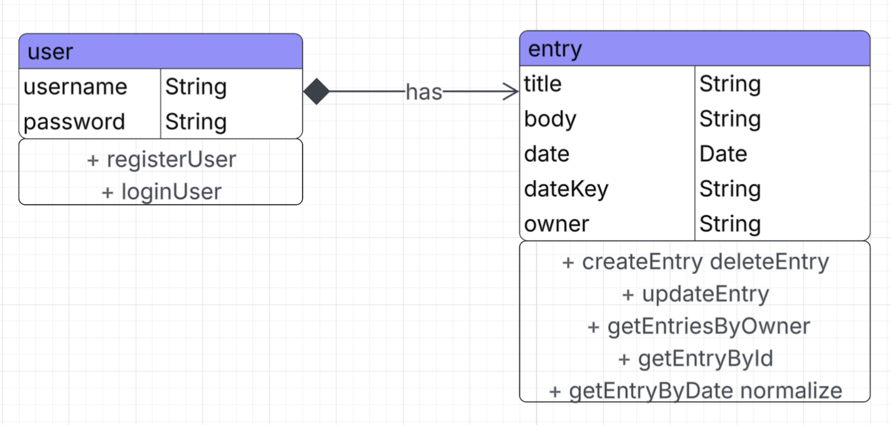
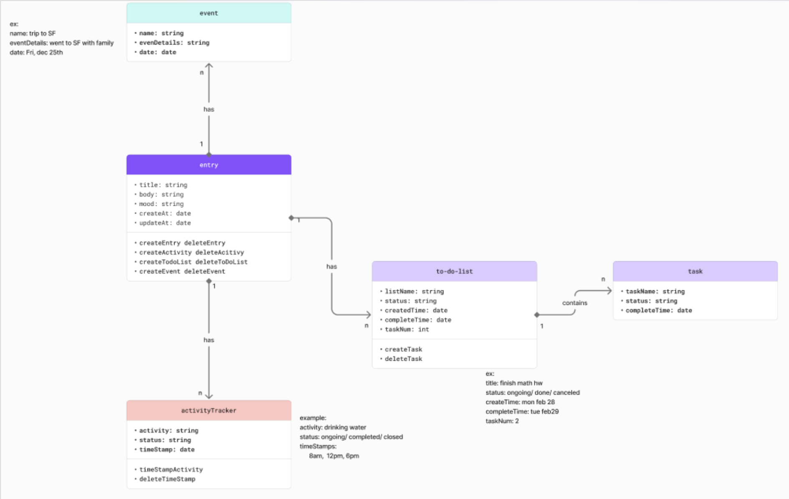

# UML Class Diagram

Last updated: March 15, 2026

## Current UML Diagram

The final implementation focuses on two primary classes:

- User
- Entry

### User

Attributes
- username : String
- password : String

Operations
- registerUser()
- loginUser()

### Entry

Attributes
- title : String
- body : String
- date : Date
- dateKey : String
- owner : String

Operations
- createEntry()
- deleteEntry()
- updateEntry()
- getEntriesByOwner()
- getEntryById()
- getEntryByDate()

Relationship

A User owns multiple Entries.

---

## Original UML Diagram

The original design included additional classes:

- Event
- ToDoList
- Task
- ActivityTracker

These features were removed to focus on the core journaling functionality.

---

## Diagram Source Files

The UML diagrams were originally created in FigJam/Figma.

The repository includes exported diagram images here:

- `docs/images/current-uml.png`
- `docs/images/original-uml.png`

A note about the original editing source is included here:

- `docs/diagrams/README.md`
